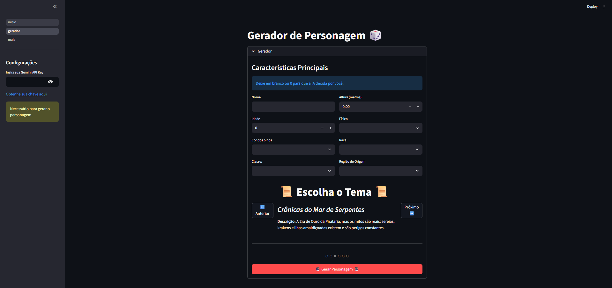

# 🎲 Gerador de Personagem RPG com IA

Este é um aplicativo web construído com **Streamlit** que utiliza a API do **Google Gemini** para gerar fichas de personagem de RPG.

O usuário pode preencher um formulário com detalhes (nome, classe, raça, etc.) e escolher um tema de cenário. A IA, então, utiliza esses dados para criar um relatório completo do personagem, inventando criativamente qualquer informação que o usuário tenha deixado em branco (como "0" ou campos vazios).

## ✨ Funcionalidades

* Formulário intuitivo para inserir detalhes do personagem.
* Carrossel para selecionar o tema do cenário (ex: Arcanopunk, Fantasia Pós-apocalíptica).
* Geração de Ficha: A IA preenche os campos vazios e cria uma história de fundo, personalidade e inventário para o personagem.
* Visualização da ficha gerada diretamente na interface.
* Botão para baixar a ficha do personagem em formato Markdown.

## 🖼️ Pré-visualização



## 🚀 Como Executar

Para rodar este projeto localmente, siga os passos abaixo:

### 1. Pré-requisitos

* Python 3.7 ou superior
* Uma Chave de API do Google Gemini (obtenha a sua no [Google AI Studio](https://aistudio.google.com/app/apikey))

### 2. Instalação

1.  **Clone o repositório** (ou apenas crie a pasta do projeto).
    ```bash
    git clone https://github.com/qualquercois1/rpg
    ```

2.  **Crie e ative um ambiente virtual** (recomendado):
    ```bash
    # Em macOS/Linux
    python3 -m venv venv
    source venv/bin/activate
    
    # Em Windows
    python -m venv venv
    .\venv\Scripts\activate
    ```

3.  **Instale as dependências**:
    ```bash
    pip install -r requirements.txt
    ```

### 3. Executando o Aplicativo

1.  Execute o Streamlit:
    ```bash
    streamlit run inicio.py
    ```
2.  O aplicativo abrirá automaticamente no seu navegador.
3.  Insira sua chave de API do Gemini na barra lateral.
4.  Preencha o formulário e gere seu personagem!

## 🛠️ Tecnologias Utilizadas

* **[Python](https://www.python.org/)**
* **[Streamlit](https://streamlit.io/)** - Para a criação da interface web.
* **[Google Gemini API](https://ai.google.dev/)** - Para a geração de conteúdo por IA.